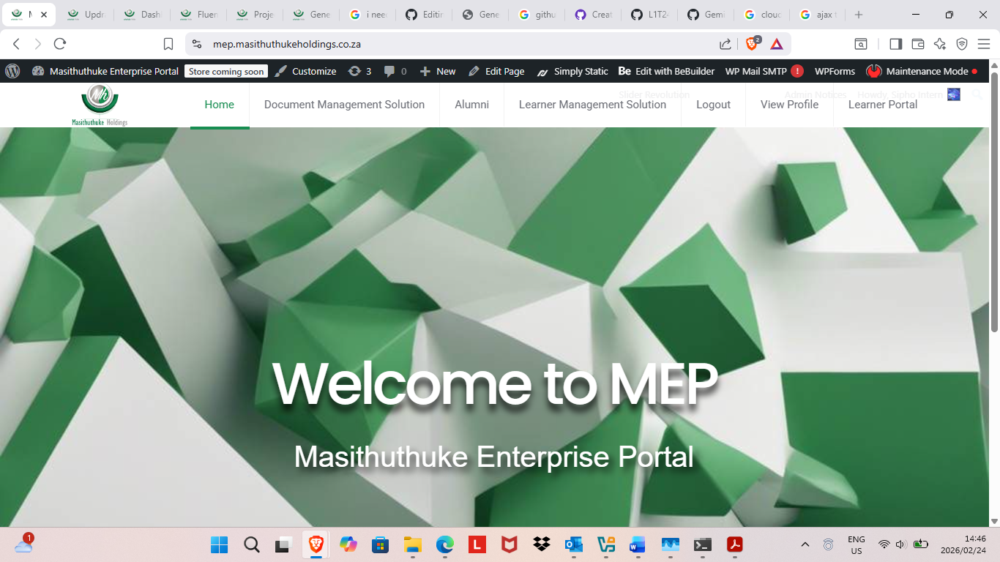
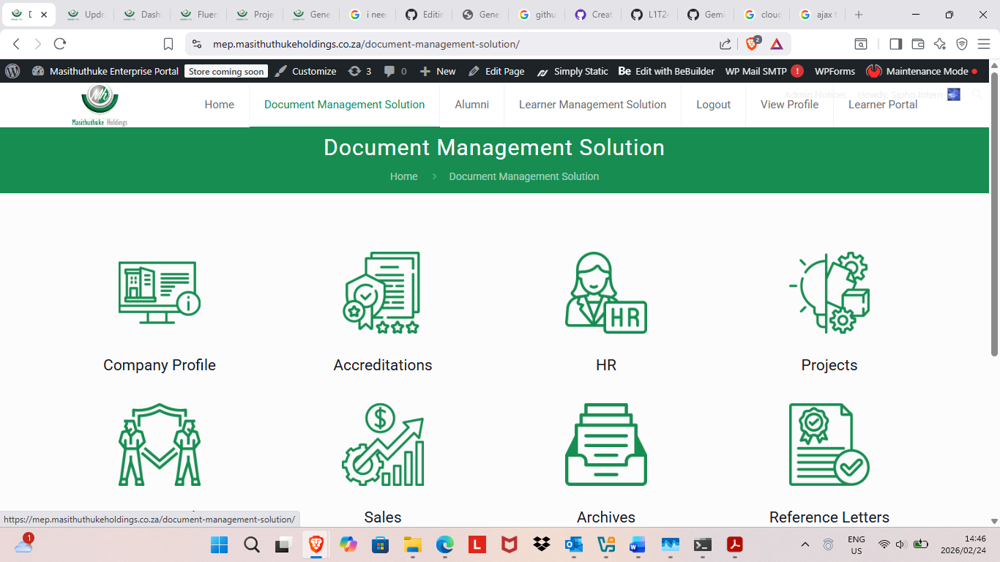
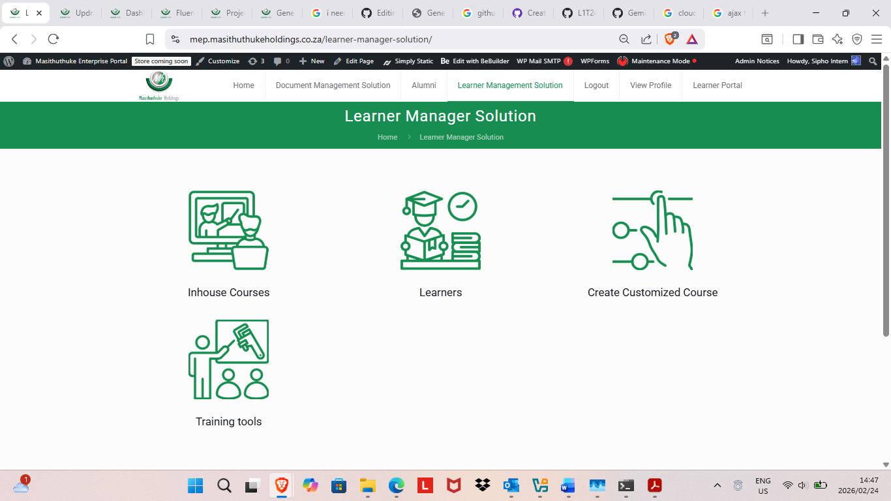
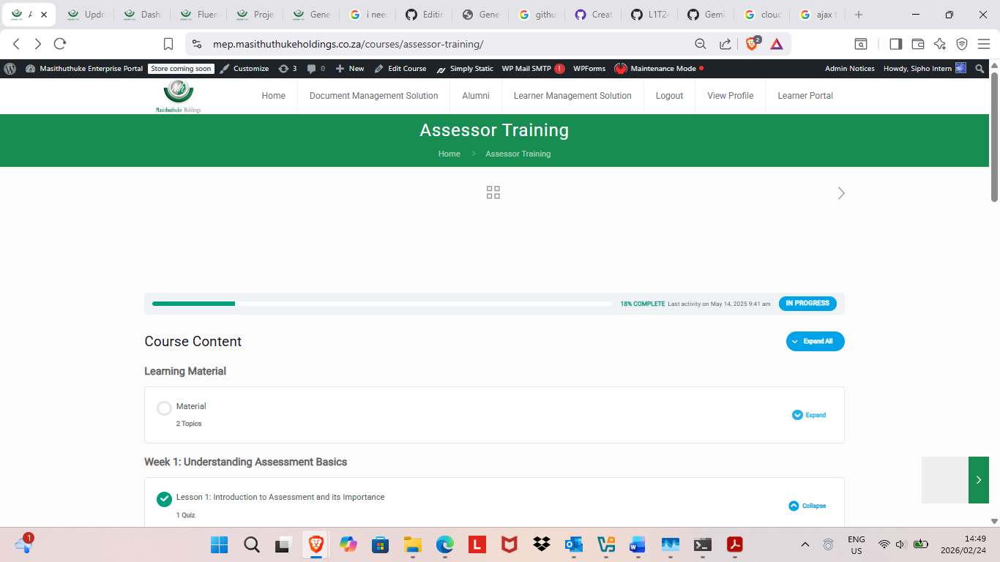
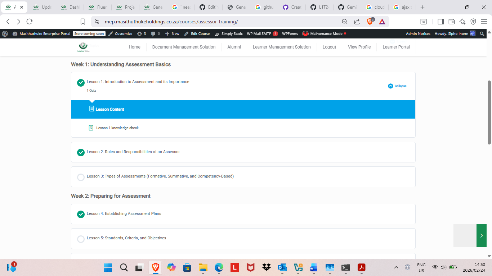
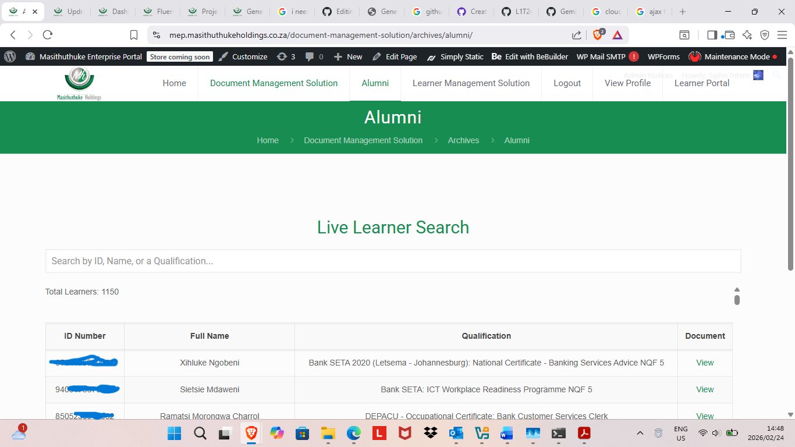
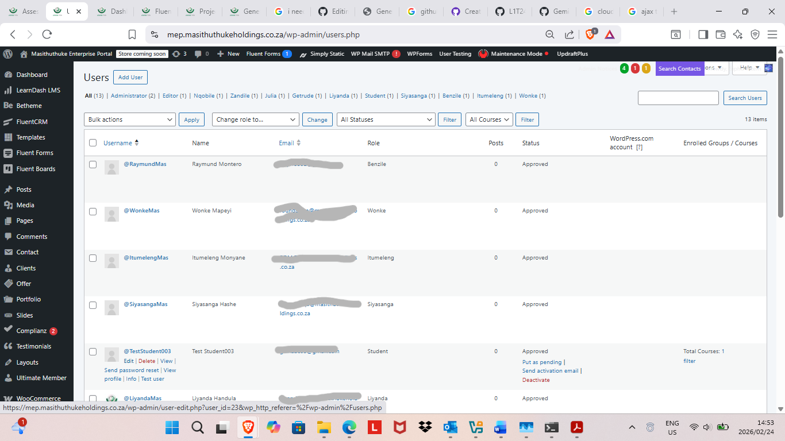
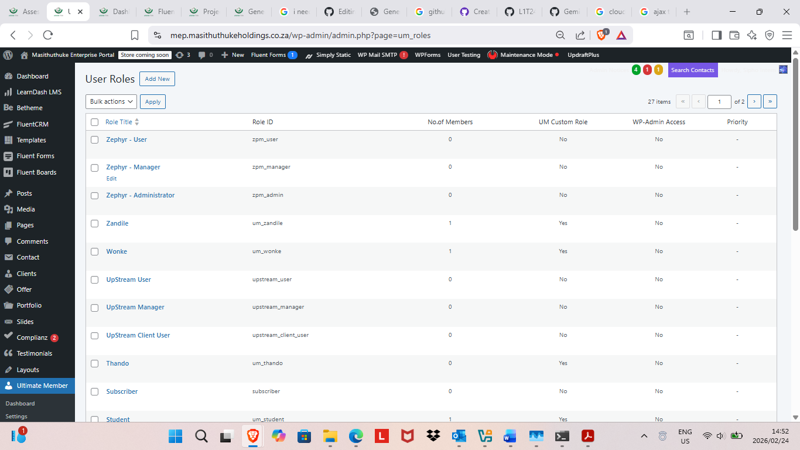

# intelligent-lms-intranet-platform
# Masithuthuke_Enterprise_Portal
Learner Management System + Document Manager Solution (Intranet)

# Project Overview
A centralized learning and internal workflow platform built using a modular CMS framework and enhanced with custom front-end logic to support structured, role-based user experiences.
The system digitizes internal processes and organizes learner data into structured dashboards, improving visibility, efficiency, and operational control.

# My Role & Contribution
-Structured role-based dashboard interfaces (Admin / Staff / Learner)
-Implemented conditional UI rendering using JavaScript
-Configured and customized plugins to digitize internal workflows
-Designed structured page hierarchy for scalable expansion
-Optimized layout and usability for better data visibility

# Front-End Enhancements
-Dynamic dashboard rendering based on user roles
-Asynchronous data loading for smoother user experience
-Client-side form validation
-UI restructuring for improved clarity and navigation

# System Design Approach
Although built on a configurable CMS framework, the system was structured with scalability in mind:
-Clear separation of user roles and permissions
-Organized content taxonomy for structured data retrieval
-Modular plugin architecture allowing future expansion
-Workflow digitization to replace manual processes

# Data-Oriented Architecture
The platform was structured to support:
-Learner progress tracking
-Role-based content segmentation
-Structured data storage for future analytics
-Expandability for AI-driven recommendation or predictive systems

# Screenshots

# Technologies Used
-JavaScript (Dynamic UI Logic)
-WordPress (Modular CMS Framework)
-MySQL (Structured Data Storage)
-HTML5 / CSS3
-Plugin Configuration & Workflow Automation
